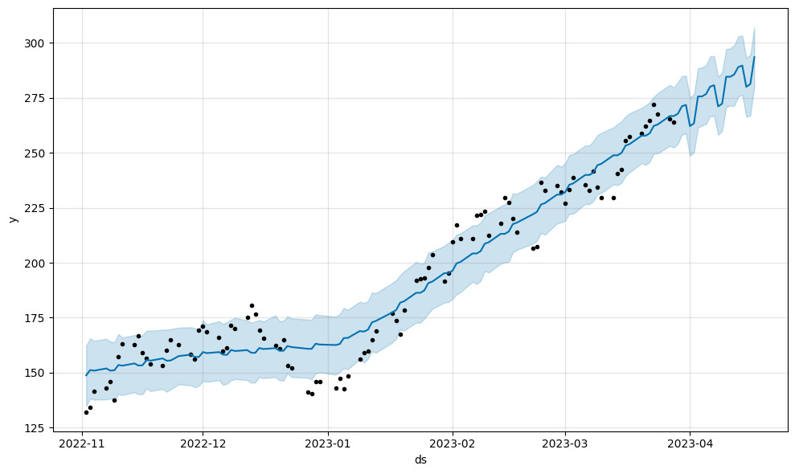

# Stock Predictor
Uses machine learning models to predict if you should buy or sell a stock using end-of-day data using the [Alpha Vantage](https://www.alphavantage.co/) API.

## Usage
- Open a Python virtual environment
- Create a new Python terminal
- Install necessary libaries using the following command:
    ```
    $ pip install numpy
    $ pip install pandas
    $ pip install scikit-learn
    $ pip install datetime
    ```
- Obtain a free API key from Alpha Vantage [here](https://www.alphavantage.co/support/#api-key).
- Read the instructions below and run your model!

# Model 1 - Classifier
This model uses classification techniques to classify a stock as 'buy' or 'sell'. All files for this model are present in the `classifier` folder. Data collection can be seen in `getdata.py`, model training can be seen in `train.py`, and model usage can be done in `use.ipynb`.

## Parameters
You can see the specific values which were used to generate the model in `settings.py`. All the changeable global parameters are visible here. Here is a quick run-down of the important ones:
- `APIKEY`: This is where you put your API key from Alpha Vantage. Remember, don't share this key and keep it safe!
- `TOPSYMBOLS`: These are the stock symbols used to obtain data.
- `DATAPERSYMBOL`: A measure of how much data to collect, this determines how many different intervals to collect per stock symbol.
- `STARTYEAR` and `ENDYEAR`: These are the bounds for which data can be collected. 
- `DATACOUNT`: This determines how big your trading day-intervals are. Therefore, now, it obtains 20 consecutive trading days.
- `RANDOMSEED`: This stores the random seed used for the sake of replicability.
- `CLASSIFYSPLIT`: This represents the proportion of the interval which will be used to determine if buying a stock was 'worth it' (more on this later).
- `MODELPATH`, `DATAPATH`, and `IPYNBMODELPATH`: These represent paths to each file needed. If you run into file-not-found errors, tweak these until you reach the right files.
- `NDAYS`: Stores the number of days right before breakpoint to analyze.

## Features Included:
- Overall Change: This is the close stock price represented as a percent of the open stock price.
- Average Change: This is the average value for the close stock price represented of the open stock price for each day. Therefore, this represents daily change.
- Average Variation: This is the standard deviation of the list of changes.
- Volume: This is the volume traded.
- N-Days Change: This is the overall change for the `NDAYS` before the break point.

## How It Works
As aforementioned, the program first collects data using the API, then analyses short intervals of a couple dozens of trading days, then classifies a stock as one you should `buy` or `sell`.

### getdata.py
This program obtains the data from the API. For each stock symbol in `TOPSYMBOLS`, it obtains a list of full history for the stock. Then, a random date is generated, from which data is collected for `DATACOUNT` days prior to the date. This step is repeated `DATAPERSYMBOL` times. When all data is collected, it is dumped into a file called `data.json`. Here is a preview of the JSON data:

<details>
<summary>View shortened data preview</summary>

```json
{
    "AAPL": {
        "0": {
            "2021-01-13": {
                "1. open": "128.76",
                "2. high": "131.45",
                "3. low": "128.49",
                "4. close": "130.89",
                "5. adjusted close": "128.977899445506",
                "6. volume": "88636831",
                "7. dividend amount": "0.0000",
                "8. split coefficient": "1.0"
            },
            "2021-01-14": {
                "1. open": "130.8",
                "2. high": "131.0",
                "3. low": "128.76",
                "4. close": "128.91",
                "5. adjusted close": "127.026824184584",
                "6. volume": "90221755",
                "7. dividend amount": "0.0000",
                "8. split coefficient": "1.0"
            }
        },
        "1": {
            "2020-09-30": {
                "1. open": "113.79",
                "2. high": "117.26",
                "3. low": "113.62",
                "4. close": "115.81",
                "5. adjusted close": "113.921431150184",
                "6. volume": "142675184",
                "7. dividend amount": "0.0000",
                "8. split coefficient": "1.0"
            },
            "2020-10-01": {
                "1. open": "117.64",
                "2. high": "117.72",
                "3. low": "115.83",
                "4. close": "116.79",
                "5. adjusted close": "114.885449823244",
                "6. volume": "116120440",
                "7. dividend amount": "0.0000",
                "8. split coefficient": "1.0"
            }
        }
    }
    "MSFT": {
        "0": {
            "2018-01-16": {
                "1. open": "90.1",
                "2. high": "90.79",
                "3. low": "88.01",
                "4. close": "88.35",
                "5. adjusted close": "82.9724385309091",
                "6. volume": "35945428",
                "7. dividend amount": "0.0000",
                "8. split coefficient": "1.0"
            },
            "2018-01-17": {
                "1. open": "89.08",
                "2. high": "90.28",
                "3. low": "88.75",
                "4. close": "90.14",
                "5. adjusted close": "84.6534873704148",
                "6. volume": "24659472",
                "7. dividend amount": "0.0000",
                "8. split coefficient": "1.0"
            }
        }
    }
}
```
</details>

### train.py
This program uses data from the `data.json` file to analyze data. Currently, the features analyzed in the implemented `RandomTreeClassifier` model from `sklearn` include the average daily change, overall change acorss the interval, variation in change, and volume traded. Numbers for each of these features are calculated for each interval in `data.json`. The above is done for the first part of the data (split using `CLASSIFYSPLIT`). Using the remaining data, the overall change in stock price is calculated; if there is a upwards change, then we buy the stock. Otherwise, we sell it. Then, the data is scaled, split into testing and training sets, and entered into the model. An accuracy test run outputted this value: 

```
The accuracy of the model is 0.6923
```

### use.ipynb
Simply execute the first two cells to load all the required variables and models; then, execute the third cell, enter a stock symbol, and analyze as many times as your API key allows you!

## Limitations
Given the volatility of the stock market, there is no telling what will happen. This model does not take into account real-life events which may affect stock price, and is limited in scope to determining short-term patterns, not long-term benefits (this can, however, be changed by tweaking the parameters).

# Model 2 - Live Regression
This model directly takes recent and makes forecasts based on that data. All files used for this model are in the `live-regression` folder.

## Parameters
Everything is in the `use.ipynb` file!
- `APIKEY`: This is where you enter your API key. Keep it safe!
- `FUTUREFORECASTDAYS`: This is how many days the model will predict. Generally, keep this under 50 to avoid over-extrapolation.

## How It Works

This model uses `Prophet` to forecast the state of a stock.

### use.ipynb

When you enter your stock, the program retrieves the most recent 100 trading days of date using the Alpha Vantage API. Then, it enters these into the regression model, which processes the data and determines what the closing price for the next `FUTUREFORECASTDAYS` days will be. When done, a graph is displayed, showing both the collected data (with dots) and the forecasted data (with a line).

Here is an example of the graph generated (this one was geenrated using the NVDA stock).



## Limitations

This model does not seem to take into account the rapid fluctuations of the stock market, which makes sense given how it forrecasts based off the most recent trend.
